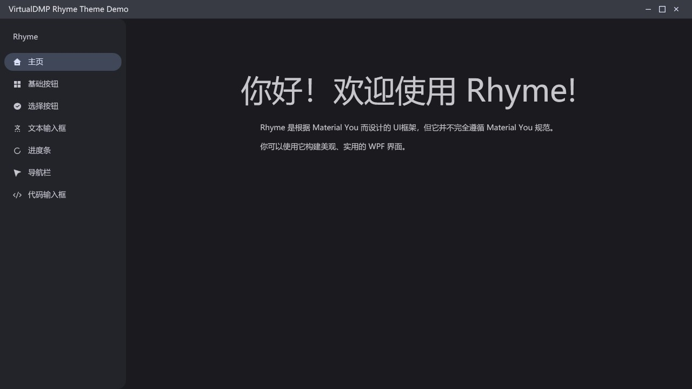
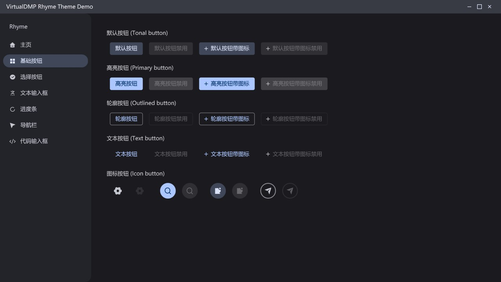
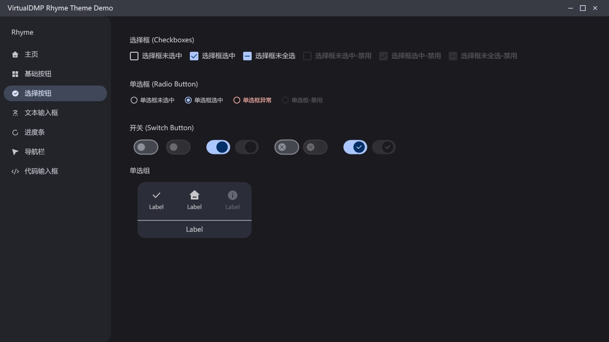
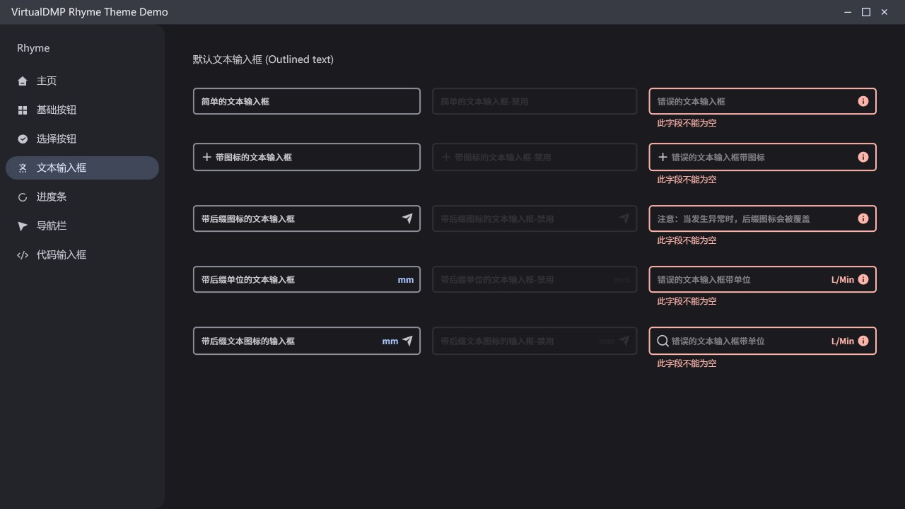
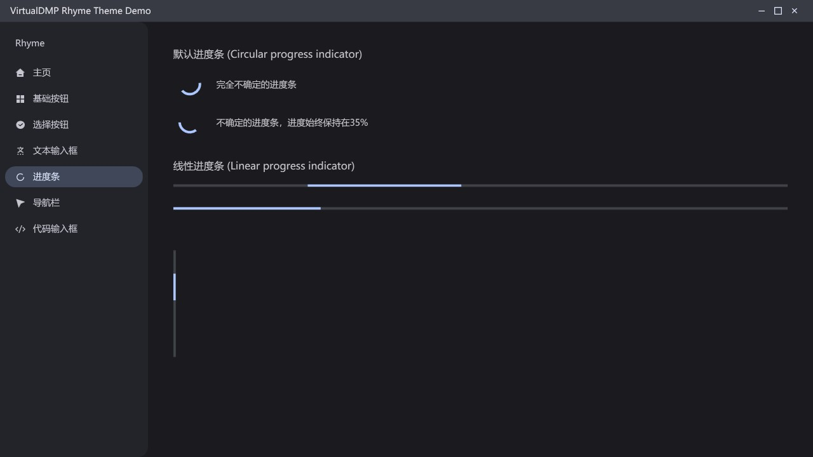
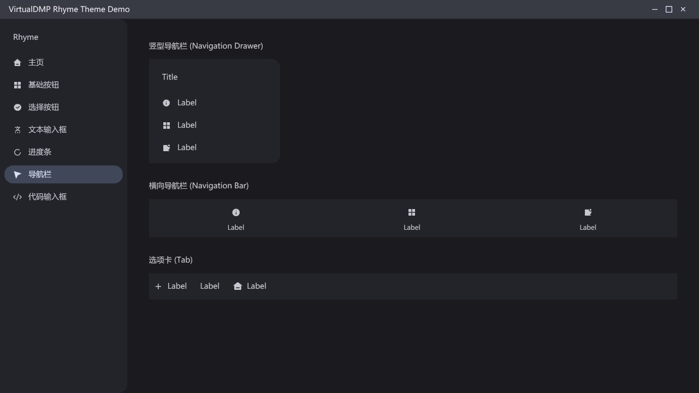

# Rhyme Theme Demo

此存储库是 [Rhyme.Theme](https://github.com/mokongh/Rhyme.Theme) 的演示程序。
控件基础由 [MaterialDesignInXamlToolkit](https://github.com/MaterialDesignInXAML/MaterialDesignInXamlToolkit) 进行改动。

## Todo

+ 代码输入框
+ 菜单项
+ ComboBox
+ 亮色主题

## 界面截图

